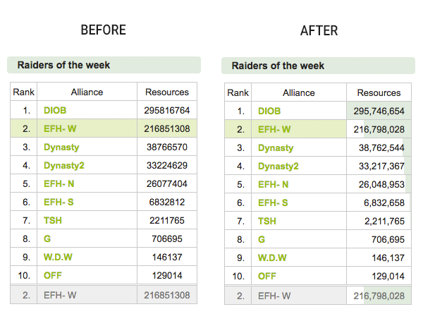

# Travian Top10 Formatter

This is a Google Chrome extension. You can install it by downloading this repository, navigating to `chrome://extensions/` and loading it by clicking `Load unpacked extension...` at the top of the page.

## Note

For playing on servers that are not ending in `*.co.uk` you need to change the `content_scripts.matches` key in `manifest.json`.
